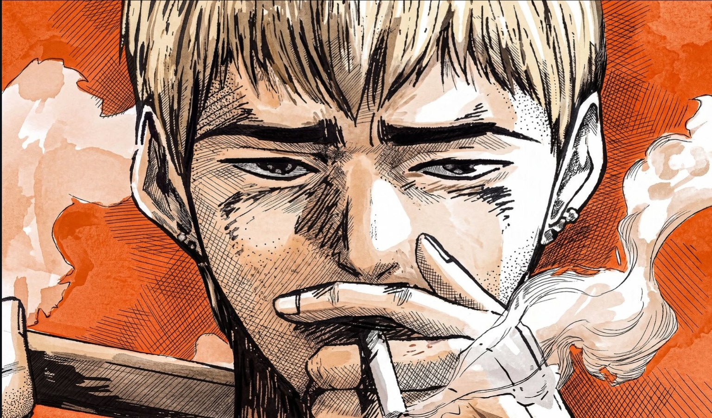

<h3>
  
</h3>

**FR** — Je construis des produits web complets et des systèmes d'agents IA qui livrent vraiment.
**EN** — I build full-stack products and AI-agent systems that actually ship.

---

## 🛠️ Ce que je construis · What I build

- 🔮 **Agora** — plateforme d'intelligence collective : un concile de LLM qui délibère, de la recherche multi-agents, une veille contradictoire.
  *EN — collective-intelligence platform: an LLM council that deliberates, multi-agent research, contradiction-aware monitoring.*
- 🎬 le site de mon propre studio créatif — 3D temps réel (three.js), GSAP, transitions sur mesure.
  *EN — my own creative studio site — real-time 3D (three.js), GSAP, handcrafted transitions.*
- 🧵 un site complet pour un atelier de couture — e-commerce, prise de rendez-vous, espace client.
  *EN — a full site for a sewing atelier — e-commerce, booking, client space.*

## 📊 Stats

<table>
  <tr>
    <td></td>
    <td></td>
  </tr>
</table>

## 🐍

<picture>
  <source media="(prefers-color-scheme: dark)" srcset="https://raw.githubusercontent.com/Rushford444/Rushford444/output/github-contribution-grid-snake.svg" />
  <source media="(prefers-color-scheme: light)" srcset="https://raw.githubusercontent.com/Rushford444/Rushford444/output/github-contribution-grid-snake.svg" />
  
</picture>

## 🧪 Playground

Des mini-projets publics arrivent — jeux, outils, expériences front. *EN — small public experiments coming: games, tools, front-end toys.*

