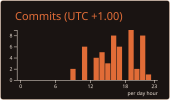

  

**FR** — Je construis des produits web complets et des systèmes d'agents IA qui livrent vraiment.

**EN** — I build full-stack products and AI-agent systems that actually ship.

  

## 🛠️ Ce que je construis · What I build

*Chaque projet se déplie — click to expand.*

🔮 <strong>Agora</strong> — plateforme d'intelligence collective

 

Un concile de LLM qui délibère, de la recherche multi-agents, une veille contradictoire.

*EN — collective-intelligence platform: an LLM council that deliberates, multi-agent research, contradiction-aware monitoring.*

🎬 <strong>Studio créatif</strong> — le site de mon propre studio

 

3D temps réel (three.js), GSAP, transitions sur mesure.

*EN — my own creative studio site — real-time 3D (three.js), GSAP, handcrafted transitions.*

🧵 <strong>Atelier de couture</strong> — un site complet, de la boutique à l'espace client

 

E-commerce, prise de rendez-vous, espace client.

*EN — a full site for a sewing atelier — e-commerce, booking, client space.*

## 🧰 Stack · Toolkit

<strong>Langages</strong>

  

<strong>Front</strong>

  
  

<strong>Back &amp; Data</strong>

  

<strong>Outils &amp; Infra</strong>

  

## 📊 Stats · Activity

  
  

  
  

  

## 🐍 Snake

## 🧪 Playground

Des mini-projets publics arrivent — jeux, outils, expériences front. *EN — small public experiments coming: games, tools, front-end toys.*

  

*Le héros du premier jeu s'échauffe. EN — the first game's hero is warming up.*

  

<em>l'encre sèche, le code reste.</em> — the ink dries, the code remains.

