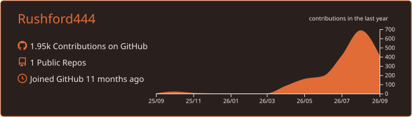
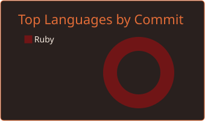
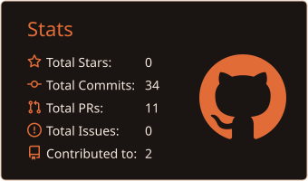
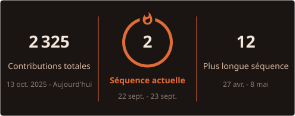

### Just a dev who ships.

**FR** — Je construis des produits web complets et des systèmes d'agents IA qui livrent vraiment.

**EN** — I build full-stack products and AI-agent systems that actually ship.

---

## 🛠️ Ce que je construis · What I build

- 🔮 **Agora** — plateforme d'intelligence collective : un concile de LLM qui délibère, de la recherche multi-agents, une veille contradictoire.
  *EN — collective-intelligence platform: an LLM council that deliberates, multi-agent research, contradiction-aware monitoring.*
- 🎬 le site de mon propre studio créatif — 3D temps réel (three.js), GSAP, transitions sur mesure.
  *EN — my own creative studio site — real-time 3D (three.js), GSAP, handcrafted transitions.*
- 🧵 un site complet pour un atelier de couture — e-commerce, prise de rendez-vous, espace client.
  *EN — a full site for a sewing atelier — e-commerce, booking, client space.*

## 🧰 Stack · Toolkit

  

## 📊 Stats · Activity

  

  
  

  

## 🐍 Snake

## 🧪 Playground

Des mini-projets publics arrivent — jeux, outils, expériences front. *EN — small public experiments coming: games, tools, front-end toys.*

---

<pre>
     _____     ____
    /      \  |  o |      just a dev who ships
   |        |/ ___\|     encre #29201e · vermillon #e16c37
   |_________/           le snake garde le graphe
   |_|_| |_|_|
</pre>

